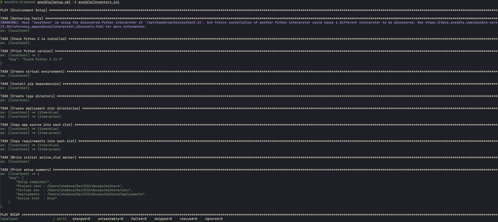
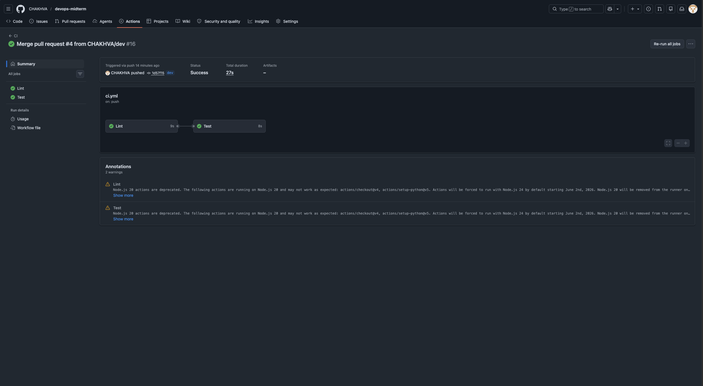
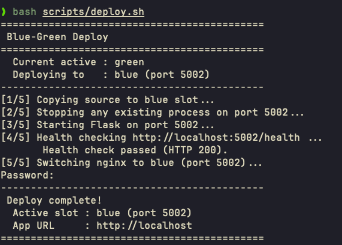
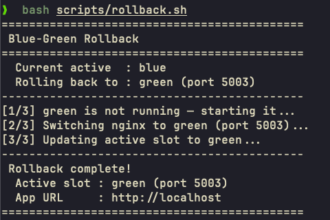
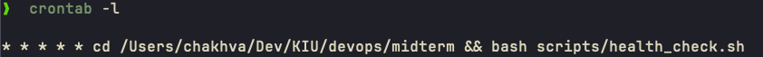
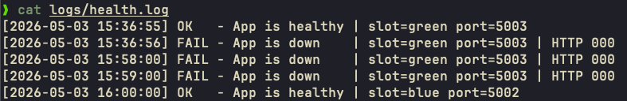

# DevOps Midterm Project

A full DevOps pipeline built around a small Flask web application, demonstrating CI/CD, Infrastructure as Code, Blue-Green Deployment, and automated monitoring.

---

## Tech Stack

| Concern            | Tool              |
| ------------------ | ----------------- |
| Web Framework      | Python / Flask    |
| Testing & Linting  | pytest, flake8    |
| Version Control    | Git / GitHub      |
| CI Pipeline        | GitHub Actions    |
| IaC                | Ansible           |
| Web Server / Proxy | Nginx             |
| Deployment         | Bash (Blue-Green) |
| Monitoring         | Bash + cron       |

---

## Project Structure

```
devops-midterm/
├── src/
│   └── main.py                  # Flask app (routes: /, /greet, /health)
├── tests/
│   └── test_app.py              # 5 unit tests
├── ansible/
│   ├── setup.yml                # IaC playbook - full environment setup
│   └── inventory.ini            # Ansible inventory (localhost)
├── scripts/
│   ├── deploy.sh                # Blue-green deploy script
│   ├── rollback.sh              # Rollback to previous slot
│   └── health_check.sh          # Periodic health check + logging
├── .github/
│   └── workflows/
│       └── ci.yml               # GitHub Actions CI pipeline
├── requirements.txt             # Python dependencies
└── README.md
```

---

## Step-by-Step Setup

### Prerequisites

- Python 3.11+
- Ansible (`brew install ansible`)
- Nginx (`brew install nginx`)
- Git

### 1. Clone the repository

```bash
git clone git@github.com:CHAKHVA/devops-midterm.git
cd devops-midterm
```

### 2. Run the IaC setup (single command)

```bash
ansible-playbook ansible/setup.yml -i ansible/inventory.ini
```

This single command:

- Verifies Python 3 is installed
- Creates a Python virtual environment at `venv/`
- Installs all pip dependencies from `requirements.txt`
- Creates `logs/`, `deployments/blue/`, `deployments/green/` directories
- Copies app source into both deployment slots
- Writes the initial `active_slot` marker (set to `blue`)



### 3. Start Nginx

```bash
sudo nginx
```

---

## Running the App Locally

```bash
# Activate the virtual environment
source venv/bin/activate

# Run the app on port 5002 (blue slot)
PORT=5002 python src/main.py
```

Open your browser at `http://localhost:5002`. Enter a name in the form and submit to see the dynamic greeting response.

---

## CI Pipeline

The pipeline is defined in `.github/workflows/ci.yml` and triggers automatically on every **push** and **pull request** to `main` or `dev`.

### Jobs

| Job  | Tool   | What it checks    |
| ---- | ------ | ----------------- |
| Lint | flake8 | Code style (PEP8) |
| Test | pytest | All 5 unit tests  |

The **Test** job only runs if **Lint** passes. Any PR to `main` must pass both jobs before merging.



### Workflow Diagram


---

## Blue-Green Deployment

Two identical environments run side by side. Nginx proxies port 80 to whichever slot is currently active. Deploying copies new code to the **inactive** slot, starts it, health-checks it, and only then switches nginx - resulting in zero downtime. The previous slot stays running, making rollback instant.

| Slot  | Port |
| ----- | ---- |
| Blue  | 5002 |
| Green | 5003 |

### Deploy

```bash
bash scripts/deploy.sh
```

The script:

1. Reads `active_slot` to determine the inactive slot
2. Copies latest source code to the inactive slot
3. Starts Flask on the inactive slot's port
4. Health-checks the new slot (`/health` must return HTTP 200)
5. If healthy: switches nginx upstream and updates `active_slot`
6. If unhealthy: kills the new process and aborts - old slot untouched




### Rollback

```bash
bash scripts/rollback.sh
```

Instantly switches nginx back to the previous slot (which is still running) and updates `active_slot`. No rebuild needed.



---

## Monitoring & Health Check

`scripts/health_check.sh` hits the `/health` endpoint of the active slot and appends a timestamped result to `logs/health.log`.

### Run manually

```bash
bash scripts/health_check.sh
```

### Run automatically every minute (cron)

```bash
crontab -e
```

Add this line:

```
* * * * * cd /path/to/devops-midterm && bash scripts/health_check.sh
```

Verify cron is configured:

```bash
crontab -l
```

### Log format

```
[2026-05-03 15:36:00] OK   - App is healthy | slot=green port=5003
[2026-05-03 15:36:07] FAIL - App is down    | slot=green port=5003 | HTTP 000
```




